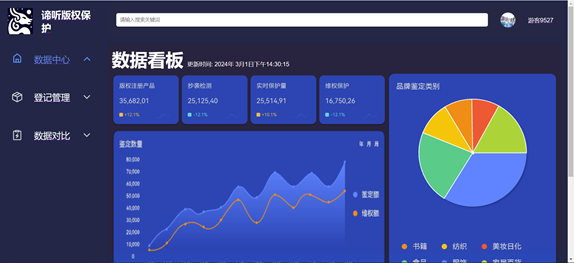
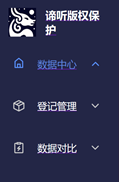
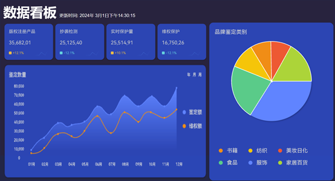
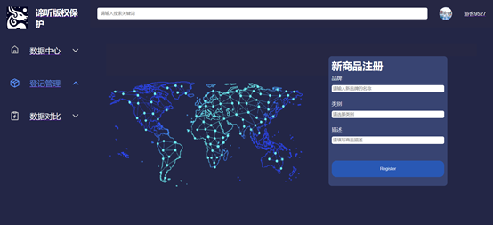
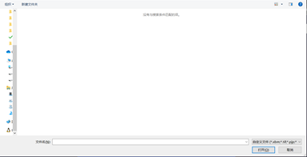
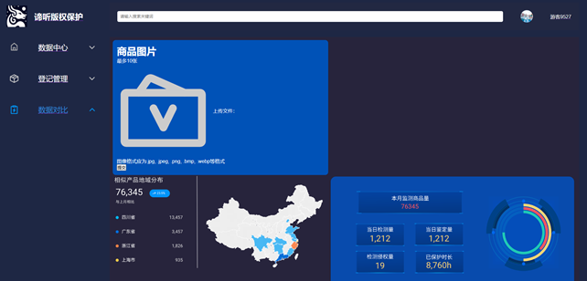
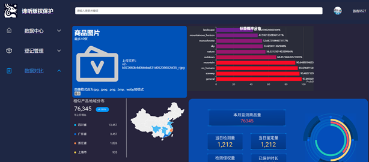
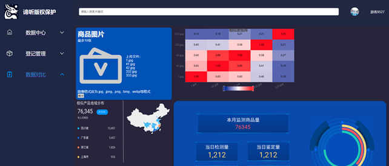

# Intelligent-Copyright-Protection-Platform (“谛听”版权保护系统)

## 一. 系统介绍

本系统是专门为中小电商设计的智能版权保护平台，提供一站式版权登记、抄袭监测和维权支持服务。通过简化操作流程和降低成本，使中小电商能高效保护原创内容，应对版权侵犯挑战，维护合法权益，促进原创文化发展。

---

## 二. 开发环境

### 硬件环境
- i5-10400F 以上
- 运行内存 16GB 以上
- 储存空间 4GB 以上
- 显卡 RTX 3050（显存 4GB 以上）

### 软件环境
- Windows 10 / Windows 11
- Python 3.9
- CUDA 11.8

---

## 三. 操作介绍

系统主界面如下图所示：  
  
左侧为功能板块切换区，中间为功能区，右上角显示用户状态。  
左侧可以看到有三个主要板块，分别为“数据中心”、“登记管理”、“数据对比”。点击对应板块可进入到对应的页面。“数据中心”提供数据看板，展示版权鉴定、版权保护等各类数据。“登记管理”可以注册商品，录入数据库以供版权鉴定。“数据对比”则可以上传图片，利用AI模型对单个图片进行特征关键词的分析，对多个图片进行相似度检测。 
 
右上角有用户状态，进入页面时会显示游客状态。点击图标可跳转到用户登录页面。 
 
---

### 1. 数据中心
点击左侧“数据中心”进入数据看板，该板块以数据展示为主。数据展示有鉴定数量、品牌鉴定类别、版权注册产品、抄袭检测等。将鼠标悬停于图标上，可以显示更详细的数据。

---

### 2. 登记管理
该板块提供商品注册。将商品的相关信息输入对应的输入框之后，点击 **Register** 按钮，商品信息会录入平台的数据库中。 

---

### 3. 数据对比
该板块提供AI技术检测抄袭功能。点击  图标后，会弹出如下窗口 
 
找到要上传的文件的文件夹，选中一个或多个商品图片，点击右下角的“打开”（可按住shift或ctrl来一次选中多个图片）。此时可以观察到页面中“上传文件：”下面呈现了上传的文件的名字（如下图）。一次最多上传10张图片。 
 
点击提交即可向后端服务器传输图片。等待半分钟左右（具体等待时间取决于计算机性能和上传图片数量），页面右侧会呈现结果。
- **单图分析**：若上传一张图片，则会呈现该图片的特征关键词。纵坐标为关键词，横坐标为该图标符合该关键词的概率，取概率最高的前10个词条。（如下图） 
  
- **多图对比**：若上传多张图片，则会呈现相似度矩阵。横纵坐标表示进行对比的两个图片。数值从0到1。数值越高，相似度越高。（如下图） 
   
- 若需要检测其他图片，则再次点击图标  上传，重复上述步骤即可。再次上传的图片会取代之前上传的图片。
---

### 4. 用户中心
点击右上角用户图标跳转登录页面，输入用户名、密码及验证码完成登录。  

